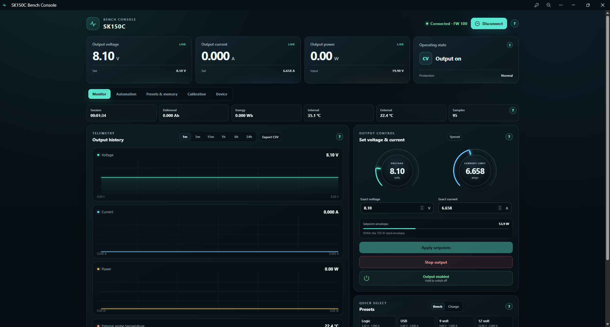
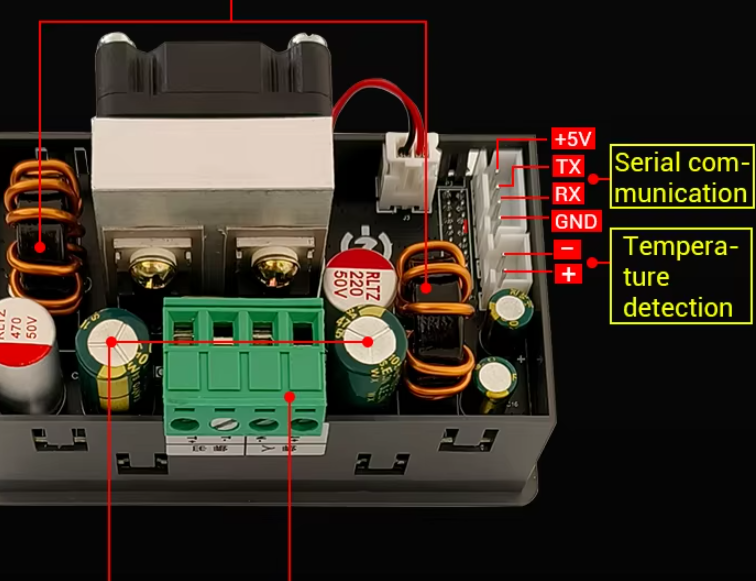

# SK150C Bench Console

A modern, local-first web dashboard and ESP32-C3 Wi-Fi bridge for the **SK150C / ZK-SK150C 150 W bench power supply**.

Monitor live voltage, current, power and temperature; graph and export telemetry; adjust setpoints; control output; run timed automation; manage presets and protection limits; and update the bridge firmware over Wi-Fi.



## Features

- Live voltage, current, power, input voltage, CV/CC state and protection status
- One-second telemetry with voltage, current, power and temperature graphs
- CSV export and up to 24 hours of local browser history
- Voltage/current controls with a 150 W envelope warning
- Press-and-hold output control and a prominent stop-output action
- Bench and battery-charging presets
- SK150C M0-M10 hardware memory recall and editing
- LVP, OVP, OCP, OPP and OTP protection-profile controls
- Timed sequences, ramps, power cycles and assisted CC/CV charging sessions
- Guided calibration workflow and local calibration journal
- Direct USB Web Serial or wireless ESP32-C3 operation
- Password-protected browser and PlatformIO OTA firmware updates
- Installable offline PWA shell (a live PSU connection is still required)

## Hardware

### Required for direct USB control

- SK150C/ZK-SK150C power supply
- Manufacturer-compatible USB-to-TTL adapter, such as the ZK-U2T/CH340 cable
- A computer running a current Chromium browser with Web Serial support (Chrome or Edge)

### Required for Wi-Fi control

- SK150C/ZK-SK150C power supply
- ESP32-C3 DevKitM-1 or compatible ESP32-C3 board
- Three signal wires: TX, RX and GND
- USB data cable for the first firmware installation
- 2.4 GHz Wi-Fi network
- A bidirectional logic-level shifter, or a suitable divider on the PSU-to-ESP RX line, **if the PSU TX signal measures 5 V**

> [!CAUTION]
> ESP32-C3 GPIO is not 5 V tolerant. Measure the SK150C TX level before connecting it directly. Do not connect the SK150C `+5V` serial pin when the ESP32 is already powered separately. Always join the SK150C and ESP32 grounds.

## ESP32 wiring

The included firmware uses the following mapping:



The four-pin serial connector is labelled, from top to bottom in the image: `+5V`, `TX`, `RX`, `GND`. The adjacent two-pin connector marked `-` and `+` is for the external temperature probe, not serial communication.

| SK150C serial connector | ESP32-C3 |
|---|---|
| TX | GPIO5 (RX) |
| RX | GPIO4 (TX) |
| GND | GND |
| +5V | Not connected |

TX and RX are crossed: the PSU's TX goes to the ESP32's RX, and vice versa. GPIO0, GPIO1, GPIO2, GPIO10, GPIO20 and GPIO21 are deliberately avoided by this build.

## Quick start: Wi-Fi bridge

### 1. Install the firmware once over USB

Install [Visual Studio Code](https://code.visualstudio.com/) with the [PlatformIO extension](https://platformio.org/install/ide?install=vscode), open `esp32-bridge`, connect the ESP32-C3 by USB, and run:

```powershell
pio run --target upload
```

Use PlatformIO for the first installation so the correct bootloader and partition table are installed. The included `esp32-bridge/firmware-update.bin` is an application image for the browser updater after that first installation; it is not a complete factory image for a blank board.

### 2. Configure Wi-Fi and security

1. Power the ESP32-C3.
2. Join the temporary **SK150C-Setup** Wi-Fi network.
3. Open `http://192.168.4.1`.
4. Enter the 2.4 GHz Wi-Fi name and password.
5. Create a bridge token of at least 12 characters and keep it somewhere safe.
6. Save. The bridge restarts and joins the selected network.

The bridge will normally be available at `http://sk150c.local`. Its status endpoint is `http://sk150c.local/api/status`.

### 3. Start the dashboard

On Windows, run:

```powershell
.\start-dashboard.ps1
```

Then open `http://127.0.0.1:4173` in Chrome or Edge. On macOS or Linux, serve the `dist` folder with any static HTTP server, for example:

```bash
python3 -m http.server 4173 --bind 127.0.0.1 --directory dist
```

In the dashboard:

1. Open **Device**.
2. Select **ESP32 HTTP bridge**.
3. Set the address to `http://sk150c.local`.
4. Enter the same bridge token.
5. Select **Save connection settings**, then **Connect PSU**.

The token is kept in browser session storage rather than embedded in the project files.

## Quick start: direct USB

1. Connect the SK150C through its supported USB-to-TTL adapter.
2. Start the dashboard as described above.
3. Open **Device** and select **USB Web Serial**.
4. Select **Connect PSU** and choose the adapter's COM/serial port.

The protocol is Modbus RTU at 115200 baud, 8 data bits, no parity, one stop bit, slave address 1. The page must be served from localhost; opening `index.html` directly will not enable Web Serial.

## Future firmware updates over Wi-Fi

After the initial USB installation, the enclosure does not need to be opened again:

1. Build a new image with `pio run` inside `esp32-bridge`.
2. Open `http://sk150c.local/update`.
3. Select `.pio/build/esp32-c3/firmware.bin`.
4. Enter the bridge token and upload.
5. Wait for the bridge to restart before reconnecting the dashboard.

PlatformIO/Arduino OTA is also enabled on port 3232 and uses the same token as its password.

To change the token, open `http://sk150c.local/setup`, re-enter the Wi-Fi details, choose a new token and save. Update the dashboard's **Session token** afterward.

## Troubleshooting

### `ESP32 bridge returned HTTP 401`

The dashboard token does not match the token stored on the bridge. Reset it at `http://sk150c.local/setup`.

### `The ESP32 received no serial bytes`

Wi-Fi is working, but the PSU did not reply electrically. Check:

- SK150C TX goes to GPIO5
- SK150C RX goes to GPIO4
- Grounds are connected
- The SK150C is powered on
- The connector orientation is correct (`+5V`, TX, RX, GND)
- The logic voltage is safe for the ESP32

### The browser cannot find `sk150c.local`

Try the IP address shown by your router or the USB serial monitor. Ensure the computer and ESP32 are on the same network and that multicast DNS is not blocked.

### Readings are exactly 10x too large

Hard-refresh the dashboard (`Ctrl+F5`) so the newest JavaScript replaces any older service-worker cache.

## Safety

- Review voltage and current before applying setpoints.
- Confirm battery chemistry, series cell count, charging limits, BMS requirements and temperature limits before charging.
- Never rely on browser automation as the only protection for an unattended battery or high-power load.
- Use suitably rated wiring, fusing, ventilation and an upstream power source appropriate for the required load.
- The guided calibration page assists with the documented physical calibration process; it does not write undocumented calibration data.

## Project layout

```text
dist/                 Static dashboard/PWA
docs/dashboard.png    Project screenshot
docs/sk150c-serial-connector.png
                      SK150C serial/temperature connector reference
esp32-bridge/         PlatformIO ESP32-C3 firmware
start-dashboard.ps1   Windows local web-server launcher
```

## License

Released under the [MIT License](LICENSE). This is an independent community project and is not affiliated with the SK150C manufacturer or seller.
